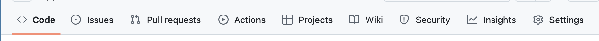
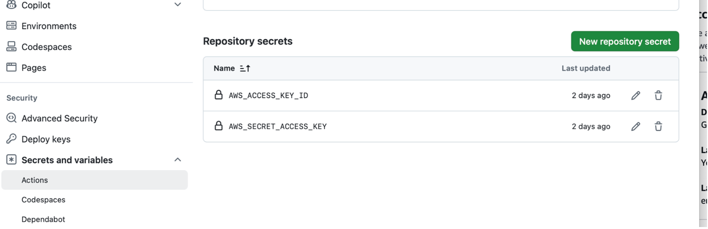
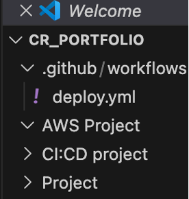
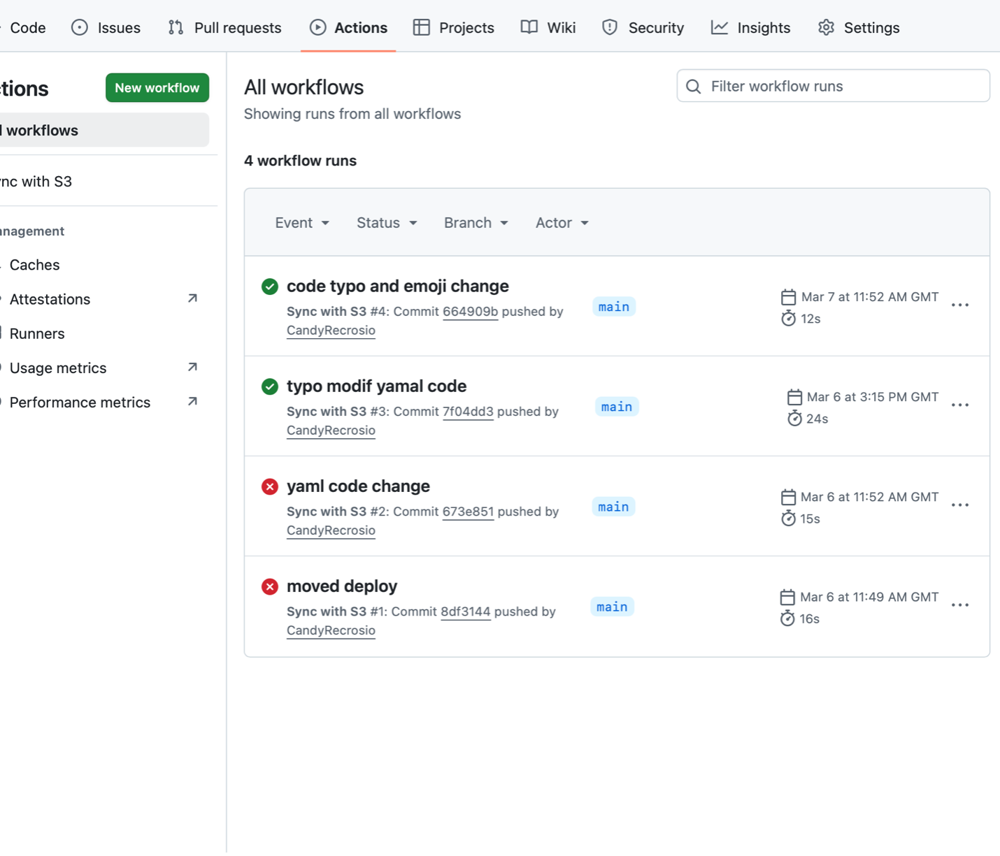

## Learning CI/CD: Deploying a Static Website to AWS S3

This project is my first end‑to‑end CI/CD pipeline, deploying a static website to an Amazon S3 bucket, using Visual Studio Code for my coding and pushing changes through a GitHub repository.
It started out as a simple project where I first built my HTML page, but it quickly turned into something more meaningful after one of my teammates in my cohort asked for help once I launched my static webpage. I originally created a quick Google Docs guide to walk her through the process, and that inspired me to turn it into a mini guide here as part of my portfolio.
This project reflects my beginning in Cloud DevOps, and it will keep improving as I grow. I’m really grateful for the training and support I’ve had through the AWS re/Start Programme (Generation UK), and for my teacher, Antony, who helped build my confidence and skills along the way.


### Git & GitHub Pre-installation

Git and my GitHub account were already pre-installed on my MacBook Pro through Homebrew. Git was directly accessible from my Mac terminal, and my GitHub account was ready to welcome my repository.


### Creating the HTML Page with Embedded CSS Using Visual Studio Code

I created my HTML web code in Visual Studio, where the preview allows me to visualise my code. For now, I added my CSS code directly into the HTML file to handle styling and effects. As I am still learning, this will soon be moved into a separate folder and linked to my index.html page.
There is also a separate media file so I can import images. For now, my cat Chiquita is the star of the website.

### AWS Account Creation and IAM Security Setup

I created my personal AWS account to start building projects and apply my simulated scenarios in a more practical environment. I enabled MFA authentication and created an administrator IAM user with the appropriate policies attached to prepare for this project. Following best practices, I also configured a CloudWatch budget alert.

### Setting Up an S3 Bucket for a Static Website

- Open the AWS Console (check which AWS region your account is set to when you do this, and modify it if needed — make sure to write it down).
- Click Create bucket, keep all settings as default, and choose a unique bucket name.

Once the bucket is created:

- Under the Properties tab of the selected bucket, edit the settings to enable Static website hosting. You will then be able to see your website endpoint.
- Under the Permissions tab, edit the settings and remove Block all public access.

⚠️ Security Note
Public access was enabled on this S3 bucket only for the purpose of hosting a static website. In a production environment, access should always follow the principle of least privilege, and sensitive data should never be exposed publicly. Additional controls such as CloudFront, HTTPS, and stricter IAM policies would be recommended.
- Still under Permissions, edit the Bucket policy and paste the following JSON policy.

```json   
{
    "Version": "2012-10-17",		 	 	 
    "Statement": [
        {
            "Sid": "PublicReadGetObject",
            "Effect": "Allow",
            "Principal": "*",
            "Action": [
                "s3:GetObject"
            ],
            "Resource": [
                "arn:aws:s3:::Bucket-Name/*"
            ]
        }
    ]
}
```
🔔 Important: Remember to replace the bucket name in the Resource field with the name of the S3 bucket you created. Also, make sure there are no extra spaces before or after the copied lines, as this may cause the policy to fail.

### Setting Up an IAM User for CI/CD and S3 Access

- Create a simple IAM user. There is no need to create a password for this account, so choose No for console access. 
- Attach the following two policies to this user :

AmazonS3FullAccess 
This policy is used to allow the IAM user to fully interact with the S3 bucket hosting the static website. It enables the pipeline to upload website files (HTML, CSS, media)
Update existing objects during deployments, list and manage bucket contents.
Full access was chosen to avoid permission issues while learning. In a production environment, this would normally be replaced with a custom policy that grants only the specific S3 actions required.  

SecretsManagerReadWrite
This policy was attached to allow the IAM user to manage secrets securely using AWS Secrets Manager. It enables storing sensitive information such as access keys, reading secrets during the CI/CD process, updating or rotating secrets if needed
Using Secrets Manager helps avoid hard‑coding sensitive credentials directly in the code or repository, which follows AWS security best practices.

- After the user is created, select it and go to the Security credentials tab. Create an access key (a public key and a private key will be generated). You can download the CSV file containing these credentials or copy them and store them somewhere safe. AWS does not allow access keys to be viewed again after creation, so they must be securely stored and treated as sensitive information.

### Navigating to Your GitHub Repository Settings

Select your repository and, inside the repository view, locate your files. Then select the Settings tab from the top navigation bar.



Once you are in the repository settings (not the global GitHub account settings), scroll down the left‑hand sidebar to Security. Click the arrow next to Secrets and variables, then select Actions.

On the right-hand side, you will now see the option to create New repository secret. Create two secrets:
- One for the Secret Access Key
- One for the Access Key ID
Copy and paste the corresponding values from the IAM user credentials you created earlier in the AWS Console.

The image below highlights where to add repository secrets for GitHub Actions within the repository settings



### Creating the .github Folder for GitHub Actions

Create a .github folder with a subfolder called workflows, and inside it create a file named deploy.yml. This is where the GitHub Actions YAML code will be pasted.
The .github/workflows folder must be located at the root (top level) of your project, above all other project folders. If it is placed elsewhere, the GitHub Actions workflow will not initialise correctly.
The dot (.) in front of the .github folder means it is a hidden directory on most operating systems. On a local machine, you may need a special command to view it.
For example, on macOS you can press Shift + Command + . to show hidden files.
However, this folder will always be visible in Visual Studio Code and directly on GitHub, which makes it easier to confirm its position.
Technically, the key requirement is that the .github folder sits at the top level of the repository.

The image below shows the correct folder structure, with the .github/workflows/deploy.yml file located at the root of the project.




When using this YAML file, remember to replace the bucket name placeholder (including removing the brackets) with your own S3 bucket name. You should also verify and update the AWS region if your setup uses a different region.

The YAML code below defines the GitHub Actions workflow. Paste it into your deploy.yml file and update the bucket name and region as needed

```yaml
name: Sync with S3


on:
 push:
   branches:
     - main


jobs:
 sync:
   runs-on: ubuntu-latest


   steps:
     - name: Checkout Repository
       uses: actions/checkout@v2


     - name: Install AWS CLI
       run: |
         sudo apt-get update
         sudo apt-get install -y awscli


     - name: Sync with S3
       env:
         AWS_ACCESS_KEY_ID: ${{ secrets.AWS_ACCESS_KEY_ID }}
         AWS_SECRET_ACCESS_KEY: ${{ secrets.AWS_SECRET_ACCESS_KEY }}
         AWS_DEFAULT_REGION: eu-west-2  # Replace with your AWS region
       run: |
         aws s3 sync . s3://[bucket name]/
```
In my setup, I had to remove these lines because they were causing an error during execution. I am not certain whether this issue was related to macOS, a version difference, or an outdated example, but removing them resolved the problem.

Below is the updated YAML code version used in this project after removing the lines that were causing errors.

```yaml
### Install AWS CLI
- name: Install AWS CLI
  run: |
   sudo apt-get update
   sudo apt-get install -y awscli
```
 So my yaml text is a below 

 ```yaml
 name: Sync with S3


on:
 push:
   branches:
     - main


jobs:
 sync:
   runs-on: ubuntu-latest


   steps:
     - name: Checkout Repository
       uses: actions/checkout@v2


     - name: Sync with S3
       env:
         AWS_ACCESS_KEY_ID: ${{ secrets.AWS_ACCESS_KEY_ID }}
         AWS_SECRET_ACCESS_KEY: ${{ secrets.AWS_SECRET_ACCESS_KEY }}
         AWS_DEFAULT_REGION: eu-west-2  # Replace with your AWS region
       run: |
         aws s3 sync . s3://mystaticwebsite-cre258/
```

Finally, commit your changes and push them to the GitHub repository to trigger the workflow.

### Running and Verifying the GitHub Actions Pipeline

Once done, go back to your GitHub repository and select the Actions tab from the top menu.




If you only see a simple menu under Actions, it usually means that the .github folder is not in the correct location, or that the workflow was not detected correctly during initialisation

As shown above, I ran the workflow four times, two runs resulted in errors .
The first error was caused by a line in the YAML code that I later removed, as mentioned earlier.
The second error was due to an incorrectly written S3 bucket name, despite triple‑checking it...

After fixing these issues, the workflow ran successfully. When a workflow run fails, you can click on it to view detailed logs, which are useful for troubleshooting and understanding what went wrong.

✅ The green check marks indicate successful runs. This confirms that the HTML content was uploaded to the S3 bucket correctly. You can also verify this by checking the bucket contents directly in the AWS Console.
You can then use the S3 static website endpoint URL to access the deployed webpage:

http://mystaticwebsite-cre258.s3-website.eu-west-2.amazonaws.com

The second successful run represents a small update made to the webpage, which confirms that changes pushed to the repository are correctly deployed through the CI/CD pipeline.

More improvements to the page are still to come 🙂

### What I Learned

This project was my first experience building an end‑to‑end CI/CD pipeline, and I learned that it is completely normal not to know everything at the beginning. Making mistakes and encountering errors was actually one of the best parts of the learning process, each error helped me better understand how the tools and services work together.
Through this project, I improved my problem‑solving skills by reading logs, troubleshooting failed workflow runs, and fixing configuration issues step by step. I also found that sharing the experience and helping others was one of the most rewarding parts of this journey, as this project originally grew from helping a teammate.
I plan to continue improving this project over time. At the moment, I am also focusing on AI‑related courses and revising for the AWS Cloud Practitioner exam, which will help me strengthen my cloud fundamentals and enhance future versions of this pipeline.